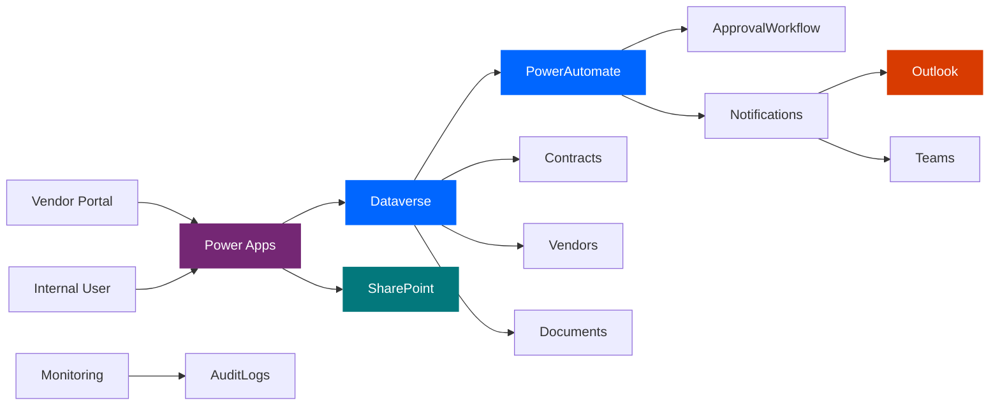
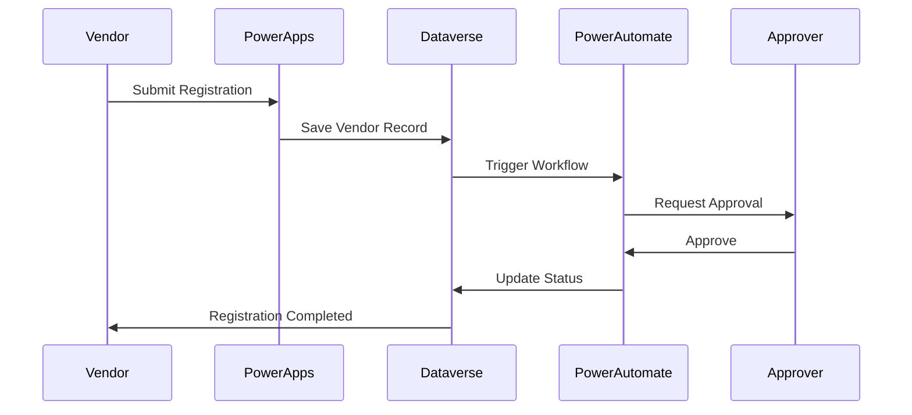

<div align="center">


<br/>

Build trusted vendor relationships with automated onboarding, approval workflows, document management, and contract lifecycle tracking.

<br/>


<br/><br/>

### One Platform. One Process. One Source of Truth.

<sub>Built for modern procurement teams and enterprise-scale vendor operations.</sub>

<br/>

<a href="https://<your-username>.github.io/<your-repo>/"></a>

<br/><br/>

[Overview](#executive-overview) · [Why](#why-this-project-matters) · [Showcase](#visual-product-showcase) · [Features](#key-features) · [Architecture](#architecture) · [Stack](#technology-stack) · [Get Started](#getting-started) · [Docs](#documentation) · [Roadmap](#project-roadmap) · [Security](#security--compliance) · [Contribute](#contribution-guide) · [Support](#support)

</div>

<br/><br/>

<div align="center">

# Experience the future<br/>of vendor management.

<br/>

Organizations lose valuable time managing vendor information across spreadsheets, emails, and disconnected tools.

The **Vendor Management System** centralizes the entire vendor lifecycle into a single, intelligent platform powered by Microsoft Power Platform.

From onboarding to approval and contract renewal,<br/>every interaction becomes **streamlined, traceable, and automated.**

</div>

<br/><br/>


<br/>

<div align="center">

# Executive Overview

<br/>

The Vendor Management System (VMS) is a complete Power Platform solution designed to simplify and automate vendor onboarding, approval management, compliance tracking, contract lifecycle management, and document storage.

Instead of relying on emails and spreadsheets, organizations gain a centralized digital workspace where every vendor interaction is visible, secure, and auditable.

</div>

<br/><br/>

<div align="center">

# Why This Project Matters

<br/>

<table>
<tr>
<td width="33%" align="center">

### 🚀
### Business Impact

Reduce onboarding delays and approval bottlenecks through automation.

</td>
<td width="33%" align="center">

### 🤝
### User Value

Provide vendors and internal teams with a smooth, transparent experience.

</td>
<td width="33%" align="center">

### 🌍
### Global Ready

Enable consistent vendor management processes across locations and departments.

</td>
</tr>
</table>

</div>

<br/><br/>


<br/>

<div align="center">

# Visual Product Showcase

<br/>

## Vendor Registration

<!-- Replace with your screenshot -->


<br/><br/>

## Executive Dashboard

<!-- Replace with your screenshot -->


<br/><br/>

## Product Walkthrough

<!-- Add GIF demo here -->


<br/><br/>

## Architecture Illustration


</div>

<br/><br/>

<div align="center">

# Key Features

<br/>

<table>
<tr>
<td align="center" width="25%">

### ✅
**Scalable**

Designed to support growing vendor ecosystems.

</td>
<td align="center" width="25%">

### 🔒
**Secure**

Enterprise-grade security powered by Microsoft technologies.

</td>
<td align="center" width="25%">

### ☁️
**Cloud Ready**

Built for modern cloud-first organizations.

</td>
<td align="center" width="25%">

### 🤖
**AI Ready**

Future-ready architecture for intelligent automation.

</td>
</tr>
<tr>
<td align="center">

### 🏢
**Enterprise Grade**

Supports governance, compliance, and audit requirements.

</td>
<td align="center">

### 📱
**Multi Platform**

Accessible from web, desktop, and mobile devices.

</td>
<td align="center">

### 🌍
**Global Ready**

Supports multinational procurement operations.

</td>
<td align="center">

### ♿
**Accessible**

Built with inclusive Microsoft design principles.

</td>
</tr>
</table>

</div>

<br/><br/>


<br/>

<div align="center">

# Architecture

</div>



<div align="center">

## Data Flow

</div>



<br/>

<div align="center">

# Technology Stack

<br/>

**Frontend**<br/>


**Backend**<br/>


**Database**<br/>


**Cloud & Collaboration**<br/>


</div>

<br/><br/>


<br/>

<div align="center">

# Getting Started

</div>


## Import Solution

1. Open Power Platform Admin Center
2. Navigate to Solutions
3. Import the solution package
4. Configure environment variables
5. Activate Power Automate flows

## Environment Variables

```env
ENVIRONMENT_NAME=Production
DATAVERSE_URL=<Dataverse URL>
SHAREPOINT_SITE=<Site URL>
TEAMS_CHANNEL=<Channel ID>
```

## Verification

✅ Vendor Registration Form Opens<br/>
✅ Dataverse Tables Connected<br/>
✅ Approval Flows Activated<br/>
✅ SharePoint Document Library Available<br/>
✅ Email Notifications Working

<br/>

<div align="center">

# Documentation

<br/>

<table>
<tr>
<td align="center" width="50%">

### 📖 User Guide

User onboarding and application usage.

</td>
<td align="center" width="50%">

### 🔗 API Documentation

Integration and connector documentation.

</td>
</tr>
<tr>
<td align="center">

### 🏗️ Architecture Guide

Solution architecture and design.

</td>
<td align="center">

### 🤝 Contributing Guide

Development standards and workflow.

</td>
</tr>
</table>

</div>

<br/><br/>


<br/>

<div align="center">

# Project Roadmap

<br/>

### Phase 1 ✅
Vendor Registration · Approval Workflows · Document Management · Contract Tracking<br/>
**Progress: 100%**

<br/>

### Phase 2 🚧
Supplier Scorecards · Power BI Analytics · Vendor Performance KPIs · Risk Assessment<br/>
**Progress: 60%**

<br/>

### Phase 3 🔮
AI Copilot for Procurement · Teams Adaptive Cards · Contract Intelligence · Predictive Vendor Scoring<br/>
**Progress: Planned**

</div>

<br/><br/>

<div align="center">

# Global Community

We believe technology should empower organizations everywhere.

<br/>

### Our Values

✅ Open Collaboration · ✅ Inclusive Design · ✅ Global Accessibility<br/>
✅ Continuous Innovation · ✅ Enterprise Excellence · ✅ Community Contribution

</div>

<br/><br/>


<br/>

<div align="center">

# Security & Compliance

<br/>

<table>
<tr>
<td width="50%" valign="top">

### Security

- Role-Based Access Control
- Microsoft Identity Integration
- Secure Dataverse Storage
- Approval Audit Trails

</td>
<td width="50%" valign="top">

### Compliance

- Enterprise Governance
- Audit Readiness
- Document Traceability
- Data Retention Support

</td>
</tr>
</table>

</div>

<br/><br/>

<div align="center">

# Contribution Guide

</div>

## Branch Strategy

```text
main
 ├── develop
 ├── feature/*
 ├── bugfix/*
 └── hotfix/*
```

## Commit Convention

```bash
feat: add vendor approval workflow

fix: resolve registration validation issue

docs: update architecture guide
```

## Pull Request Workflow

1. Create Feature Branch
2. Complete Development
3. Run Testing
4. Submit Pull Request
5. Code Review
6. Merge to Main

<br/>

<div align="center">

# Performance Metrics

<br/>

<table>
<tr>
<td align="center" width="25%">

## ⚡
**Speed**

<sub>Automated onboarding workflows</sub>

</td>
<td align="center" width="25%">

## 🟢
**Reliability**

<sub>Centralized vendor processing</sub>

</td>
<td align="center" width="25%">

## 🌐
**Availability**

<sub>Cloud-first architecture</sub>

</td>
<td align="center" width="25%">

## 📊
**Scalability**

<sub>Enterprise-grade platform</sub>

</td>
</tr>
</table>

</div>

<br/><br/>

<div align="center">

# Frequently Asked Questions

</div>

<details>
<summary><b>Can this solution be deployed in any Power Platform environment?</b></summary>

Yes. The solution can be imported into Development, Test, or Production environments.

</details>

<details>
<summary><b>Does it support SharePoint document storage?</b></summary>

Yes. Vendor documents can be stored and managed through SharePoint.

</details>

<details>
<summary><b>Can approval workflows be customized?</b></summary>

Absolutely. Power Automate allows complete workflow customization.

</details>

<br/>

<div align="center">

# Support

### Need Help?

💬 Microsoft Teams · 🐞 GitHub Issues · 📘 Project Documentation

</div>

<br/>

<div align="center">


Built with ❤️ using Microsoft Power Platform

© 2026 Vendor Management System

Empowering organizations to create better vendor experiences.

⭐ If you found this project useful, please consider starring the repository.

</div>
